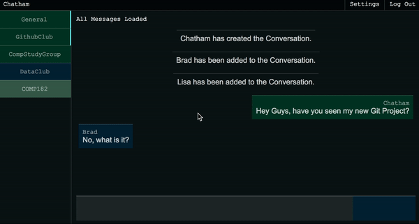

# NodeChat
A web based messaging platform intended for quick and convient conversations within a small network. __NodeChat__ uses Node.js with Express to run its backend server and React.js to run its client.

## Preview


## Quick Start

``` bash
# Install dependencies for server
npm install

# Install dependencies for client
npm run client-install

# Run the client & server with concurrently
npm run dev

# Run the Express server only
npm run server

# Run the React client only
npm run client

# Server runs on http://localhost:5000 and client on http://localhost:3000
```


### License

This project is licensed under the MIT License
